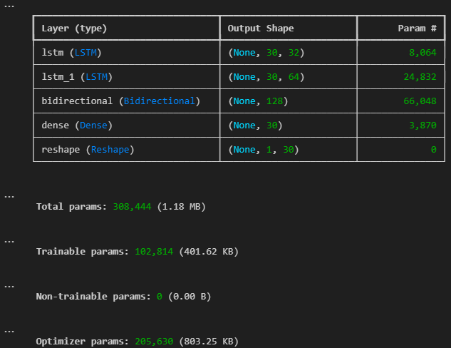
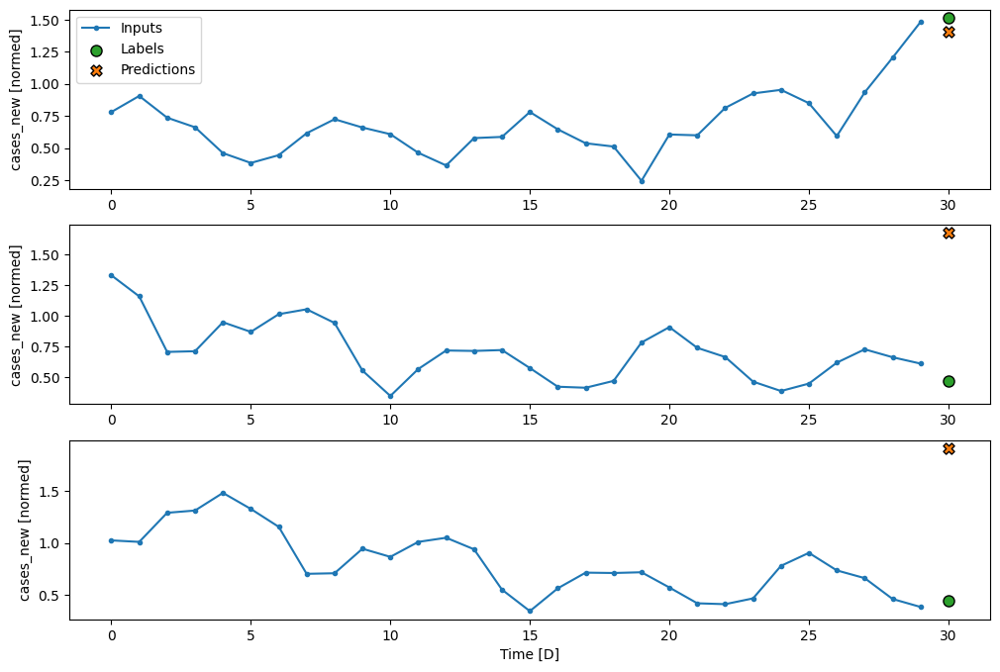
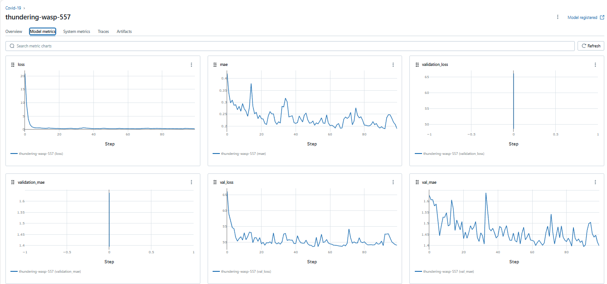

# Capstone 1: Covid-19 Prediction using LSTM

## Project Overview

The year 2020 marked a catastrophic event in human history due to the COVID-19 pandemic. The virus rapidly spread across the globe, severely affecting more than 200 countries. In response, many governments imposed various measures such as travel restrictions, quarantines, and lockdowns to mitigate the virus's spread. However, a lack of efficient tracking and predicting systems led to the exacerbation of the crisis. 

This project aims to utilize deep learning, specifically an LSTM (Long Short-Term Memory) neural network model, to predict daily COVID-19 cases in Malaysia. By analyzing the past 30 days of case data, the model will forecast new cases, helping inform decisions on whether travel bans should be imposed or lifted.

## Project Objectives

1. **Data Preparation**: Preprocess the provided dataset and prepare the input data for the LSTM model.
2. **Model Implementation**: Build an LSTM-based model using TensorFlow/Keras to predict daily COVID-19 cases.
3. **Single-step Prediction**: The model will predict future cases based on the past 30 days of data.
4. **MLflow Integration**: Use MLflow to track the training process, hyperparameters, and metrics.
5. **Prediction and Visualization**: Generate predictions on test data and plot a graph to compare actual vs predicted cases.

## Project Requirements

- **Data Preparation**: Clean, preprocess, and create input-output windows of the data for LSTM.
- **Model Architecture**: Build an LSTM model with an appropriate architecture for time-series prediction.
- **MLflow**: Use MLflow to log and track training experiments.
- **Testing and Visualization**: Generate predictions on test data and visualize the results.

## Folder Structure

```
|-- dataset/
    |-- training_data.csv
    |-- test_data.csv
|-- model/
    |-- LSTM_model.py
    |-- model_architecture.png
|-- results/
    |-- prediction_vs_actual.png
    |-- mlflow_results.png
|-- train.ipynb
|-- time_series_helper.py
|-- README.md
```

## Installation

To run this project locally, you'll need to set up the required dependencies. 

### Step 1: Clone the repository
```bash
git clone https://github.com/yourusername/covid19-prediction-lstm.git
cd covid19-prediction-lstm
```

### Step 2: Install required libraries
You can create a virtual environment and install the dependencies using `pip`:

```bash
pip install -r requirements.txt
```

### Step 3: Run the Project

**Model Training**: To train the LSTM model, you have to open the train.ipynb file run the code:

### Step 4: View the Results

1. **MLflow Dashboard**: You can track the experiment results by running the following command:
   ```bash
   mlflow ui
   ```
   This will open a local server at `http://127.0.0.1:5000` where you can view your experiment details.

2. **Prediction vs Actual Graph**: After training, you can view the graph comparing the predicted and actual COVID-19 cases in `results/prediction_vs_actual.png`.

## Model Architecture

Below is the architecture of the LSTM model used in this project.



## Results

### Prediction vs Actual Cases

Here is a comparison between the predicted COVID-19 cases and the actual cases on the test dataset:



### MLflow Training Results

The following image shows the training results and metrics tracked by MLflow:



## Dataset

The dataset used in this project is the official COVID-19 dataset for Malaysia, which can be found at [MoH Malaysia GitHub Repository](https://github.com/MoH-Malaysia/covid19-public/tree/main). It contains the daily reported cases of COVID-19 in Malaysia, which is used to train and test the prediction model.

## Credits

- **Dataset**: MoH Malaysia - [COVID-19 Data](https://github.com/MoH-Malaysia/covid19-public/blob/main/epidemic/cases_malaysia.csv)
- **Libraries**: 
  - TensorFlow/Keras for the LSTM model
  - MLflow for experiment tracking
  - Matplotlib for plotting

## Submission Details

- Main Python file: `train.ipynb`
- Dataset: `datasest/`
- Architecture diagram: `model/model_architecture.png`
- Training and performance results images: `results/`
- GitHub URL: [GitHub Repository Link](https://github.com/jamkacak/covid19-prediction-lstm)

